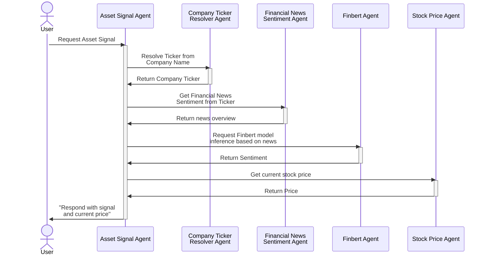

# Asset Signal Agent

![domain:finance](https://img.shields.io/badge/finance-3D8BD3?style=flat&logo=data:image/svg+xml;base64,PHN2ZyB3aWR0aD0iOCIgaGVpZ2h0PSI2IiB2aWV3Qm94PSIwIDAgOCA2IiBmaWxsPSJub25lIiB4bWxucz0iaHR0cDovL3d3dy53My5vcmcvMjAwMC9zdmciPgo8cGF0aCBkPSJNNCA0LjVDMS43ODEyNSA0LjUgMCAzLjUgMCAyLjI1QzAgMS4wMTU2MiAxLjc4MTI1IDAgNCAwQzYuMjAzMTIgMCA4IDEuMDE1NjIgOCAyLjI1QzggMy41IDYuMjAzMTIgNC41IDQgNC41Wk0xLjM0Mzc1IDIuODkwNjJDMS41MzEyNSAzLjA2MjUgMS43ODEyNSAzLjIwMzEyIDIuMDQ2ODggMy4yOTY4OEMyLjU2MjUgMy41MTU2MiAzLjI1IDMuNjI1IDQgMy42MjVDNC43MzQzOCAzLjYyNSA1LjQyMTg4IDMuNTE1NjIgNS45NTMxMiAzLjI5Njg4QzYuMjAzMTIgMy4yMDMxMiA2LjQ1MzEyIDMuMDYyNSA2LjY0MDYyIDIuODkwNjJDNi44MjgxMiAyLjcwMzEyIDcgMi40NTMxMiA3IDIuMTI1QzcgMS44MTI1IDYuODI4MTIgMS41NjI1IDYuNjQwNjIgMS4zNzVDNi40NTMxMiAxLjIwMzEyIDYuMjAzMTIgMS4wNjI1IDUuOTUzMTIgMC45NTMxMjVDNS40MjE4OCAwLjc1IDQuNzM0MzggMC42MjUgNCAwLjYyNUMzLjI1IDAuNjI1IDIuNTYyNSAwLjc1IDIuMDQ2ODggMC45NTMxMjVDMS43ODEyNSAxLjA2MjUgMS41MzEyNSAxLjIwMzEyIDEuMzQzNzUgMS4zNzVDMS4xNTYyNSAxLjU2MjUgMSAxLjgxMjUgMSAyLjEyNUMxIDIuNDUzMTIgMS4xNTYyNSAyLjcwMzEyIDEuMzQzNzUgMi44OTA2MlpNMS41IDIuMTI1QzEuNSAxLjU3ODEyIDIuNjA5MzggMS4xMjUgNCAxLjEyNUM1LjM3NSAxLjEyNSA2LjUgMS41NzgxMiA2LjUgMi4xMjVDNi41IDIuNjg3NSA1LjM3NSAzLjEyNSA0IDMuMTI1QzIuNjA5MzggMy4xMjUgMS41IDIuNjg3NSAxLjUgMi4xMjVaTTAgMy41NDY4OEMwLjIwMzEyNSAzLjc4MTI1IDAuNDUzMTI1IDQgMC43NSA0LjE3MTg4VjUuMTcxODhDMC4yNjU2MjUgNC44NDM3NSAwIDQuNDM3NSAwIDRWMy41NDY4OFpNMS4yNSA1LjQ1MzEyVjQuNDUzMTJDMS42ODc1IDQuNjU2MjUgMi4xODc1IDQuODEyNSAyLjc1IDQuOTA2MjVWNS45MDYyNUMyLjE3MTg4IDUuODEyNSAxLjY3MTg4IDUuNjU2MjUgMS4yNSA1LjQ1MzEyWk0zLjI1IDUuOTY4NzVWNC45Njg3NUMzLjQ4NDM4IDUgMy43MzQzOCA1LjAxNTYyIDQgNS4wMTU2MkM0LjI1IDUuMDE1NjIgNC41IDUgNC43NSA0Ljk2ODc1VjUuOTY4NzVDNC41IDYgNC4yNSA2IDQgNkMzLjczNDM4IDYgMy40ODQzOCA2IDMuMjUgNS45Njg3NVpNNS4yNSA1LjkwNjI1VjQuOTA2MjVDNS43OTY4OCA0LjgxMjUgNi4yOTY4OCA0LjY1NjI1IDYuNzUgNC40NTMxMlY1LjQ2ODc1QzYuMzEyNSA1LjY1NjI1IDUuODEyNSA1LjgxMjUgNS4yNSA1LjkwNjI1Wk03LjI1IDUuMTcxODhWNC4xNzE4OEM3LjUzMTI1IDQgNy43ODEyNSAzLjc4MTI1IDggMy41NDY4OFY0QzggNC40Mzc1IDcuNzE4NzUgNC44NDM3NSA3LjI1IDUuMTcxODhaIiBmaWxsPSJ3aGl0ZSIvPgo8L3N2Zz4K)
![tech:tech-name](https://img.shields.io/badge/tech%20tag-E85D2E?style=flat&logo=data%3Aimage%2Fsvg%2Bxml%3Bbase64%2CPHN2ZyB3aWR0aD0iMTAiIGhlaWdodD0iOCIgdmlld0JveD0iMCAwIDEwIDgiIGZpbGw9Im5vbmUiIHhtbG5zPSJodHRwOi8vd3d3LnczLm9yZy8yMDAwL3N2ZyI%2BCjxwYXRoIGQ9Ik00LjUgMUM0LjUgMS4yMTg3NSA0LjQyMTg4IDEuNDIxODggNC4zMTI1IDEuNTc4MTJMNC43NjU2MiAyLjU2MjVDNC45MjE4OCAyLjUzMTI1IDUuMDc4MTIgMi41IDUuMjUgMi41QzUuODEyNSAyLjUgNi4zMjgxMiAyLjcxODc1IDYuNzE4NzUgMy4wNjI1TDggMi4xMDkzOEM4IDIuMDc4MTIgOCAyLjA0Njg4IDggMkM4IDEuNDUzMTIgOC40Mzc1IDEgOSAxQzkuNTQ2ODggMSAxMCAxLjQ1MzEyIDEwIDJDMTAgMi41NjI1IDkuNTQ2ODggMyA5IDNDOC44NDM3NSAzIDguNzE4NzUgMi45ODQzOCA4LjU5Mzc1IDIuOTIxODhMNy4zMTI1IDMuODU5MzhDNy40MjE4OCA0LjE0MDYyIDcuNSA0LjQzNzUgNy41IDQuNzVDNy41IDUgNy40NTMxMiA1LjIzNDM4IDcuMzc1IDUuNDUzMTJMOC41IDYuMTI1QzguNjU2MjUgNi4wNDY4OCA4LjgxMjUgNiA5IDZDOS41NDY4OCA2IDEwIDYuNDUzMTIgMTAgN0MxMCA3LjU2MjUgOS41NDY4OCA4IDkgOEM4LjQzNzUgOCA4IDcuNTYyNSA4IDdWNi45ODQzOEw2Ljg1OTM4IDYuMzEyNUM2LjQ1MzEyIDYuNzM0MzggNS44NzUgNyA1LjI1IDdDNC4xNzE4OCA3IDMuMjgxMjUgNi4yNjU2MiAzLjA0Njg4IDUuMjVIMS44NTkzOEMxLjY4NzUgNS41NjI1IDEuMzU5MzggNS43NSAxIDUuNzVDMC40Mzc1IDUuNzUgMCA1LjMxMjUgMCA0Ljc1QzAgNC4yMDMxMiAwLjQzNzUgMy43NSAxIDMuNzVDMS4zNTkzOCAzLjc1IDEuNjg3NSAzLjk1MzEyIDEuODU5MzggNC4yNUgzLjA0Njg4QzMuMTcxODggMy43MzQzOCAzLjQ1MzEyIDMuMjk2ODggMy44NTkzOCAyLjk4NDM4TDMuNDA2MjUgMkMyLjg5MDYyIDEuOTUzMTIgMi41IDEuNTMxMjUgMi41IDFDMi41IDAuNDUzMTI1IDIuOTM3NSAwIDMuNSAwQzQuMDQ2ODggMCA0LjUgMC40NTMxMjUgNC41IDFaTTUuMjUgNS41QzUuNTE1NjIgNS41IDUuNzUgNS4zNTkzOCA1Ljg5MDYyIDUuMTI1QzYuMDMxMjUgNC45MDYyNSA2LjAzMTI1IDQuNjA5MzggNS44OTA2MiA0LjM3NUM1Ljc1IDQuMTU2MjUgNS41MTU2MiA0IDUuMjUgNEM0Ljk2ODc1IDQgNC43MzQzOCA0LjE1NjI1IDQuNTkzNzUgNC4zNzVDNC40NTMxMiA0LjYwOTM4IDQuNDUzMTIgNC45MDYyNSA0LjU5Mzc1IDUuMTI1QzQuNzM0MzggNS4zNTkzOCA0Ljk2ODc1IDUuNSA1LjI1IDUuNVoiIGZpbGw9IndoaXRlIi8%2BCjwvc3ZnPgo%3D)
[![link to source code](https://img.shields.io/badge/Source%20Code-E8ECF1?style=flat&logo=data%3Aimage%2Fsvg%2Bxml%3Bbase64%2CPHN2ZyB3aWR0aD0iOCIgaGVpZ2h0PSI4IiB2aWV3Qm94PSIwIDAgOCA4IiBmaWxsPSJub25lIiB4bWxucz0iaHR0cDovL3d3dy53My5vcmcvMjAwMC9zdmciPgo8cGF0aCBkPSJNNCAwLjA5ODk5OUMxLjc5IDAuMDk4OTk5IDAgMS44OSAwIDQuMDk5QzAgNS44NjY2NyAxLjE0NiA3LjM2NTY2IDIuNzM1IDcuODk0QzIuOTM1IDcuOTMxNjYgMy4wMDgzMyA3LjgwOCAzLjAwODMzIDcuNzAxNjZDMy4wMDgzMyA3LjYwNjY2IDMuMDA1IDcuMzU1IDMuMDAzMzMgNy4wMjE2N0MxLjg5MDY3IDcuMjYzIDEuNjU2IDYuNDg1IDEuNjU2IDYuNDg1QzEuNDc0IDYuMDIzMzMgMS4yMTEgNS45IDEuMjExIDUuOUMwLjg0ODY2NyA1LjY1MiAxLjIzOSA1LjY1NyAxLjIzOSA1LjY1N0MxLjY0MDY3IDUuNjg1IDEuODUxNjcgNi4wNjkgMS44NTE2NyA2LjA2OUMyLjIwODMzIDYuNjgwNjcgMi43ODggNi41MDQgMy4wMTY2NyA2LjQwMTY2QzMuMDUyNjcgNi4xNDMgMy4xNTU2NyA1Ljk2NjY3IDMuMjcgNS44NjY2N0MyLjM4MTY3IDUuNzY2NjcgMS40NDggNS40MjI2NyAxLjQ0OCAzLjg5QzEuNDQ4IDMuNDUzMzMgMS42MDMgMy4wOTY2NyAxLjg1OTY3IDIuODE2NjdDMS44MTQ2NyAyLjcxNTY3IDEuNjc5NjcgMi4zMDkgMS44OTQ2NyAxLjc1OEMxLjg5NDY3IDEuNzU4IDIuMjI5NjcgMS42NTA2NyAyLjk5NDY3IDIuMTY4QzMuMzE0NjcgMi4wNzkgMy42NTQ2NyAyLjAzNSAzLjk5NDY3IDIuMDMzQzQuMzM0NjcgMi4wMzUgNC42NzQ2NyAyLjA3OSA0Ljk5NDY3IDIuMTY4QzUuNzU0NjcgMS42NTA2NyA2LjA4OTY3IDEuNzU4IDYuMDg5NjcgMS43NThDNi4zMDQ2NyAyLjMwOSA2LjE2OTY3IDIuNzE1NjcgNi4xMjk2NyAyLjgxNjY3QzYuMzg0NjcgMy4wOTY2NyA2LjUzOTY3IDMuNDUzMzMgNi41Mzk2NyAzLjg5QzYuNTM5NjcgNS40MjY2NyA1LjYwNDY3IDUuNzY1IDQuNzE0NjcgNS44NjMzM0M0Ljg1NDY3IDUuOTgzMzMgNC45ODQ2NyA2LjIyODY2IDQuOTg0NjcgNi42MDMzM0M0Ljk4NDY3IDcuMTM4NjYgNC45Nzk2NyA3LjU2ODY3IDQuOTc5NjcgNy42OTg2N0M0Ljk3OTY3IDcuODAzNjcgNS4wNDk2NyA3LjkyODY3IDUuMjU0NjcgNy44ODg2N0M2Ljg1NSA3LjM2NCA4IDUuODY0IDggNC4wOTlDOCAxLjg5IDYuMjA5IDAuMDk4OTk5IDQgMC4wOTg5OTlaIiBmaWxsPSIjNTU2NTc4Ii8%2BCjwvc3ZnPgo%3D)](...)

**DISCLAIMER: THE RESULTS FROM THIS AGENT ARE NOT CONSIDERED FINANCIAL ADVICE.**

This agent will generate a context from information from other agents (as seen in the diagram below) to give you a general signal about a financial asset of a company.
The return value contains a list of urls as sources that were factored into the final result.

## Diagram



## Example input

```python
AssetSignalRequest(
    company_name="Apple"
)
```

## Example output

```python
AssetSignalResponse(
    signal="WAIT",
    price=230.28,
    sources={
        ...
    },
)
```

## Usage Example

Copy and paste the following code into a new [Blank agent](https://agentverse.ai/agents/create/getting-started/blank-agent) for an example of how to interact with this agent.

```python
from typing import Literal, Set

from uagents import Agent, Context, Model


class AssetSignalRequest(Model):
    company_name: str


class AssetSignalResponse(Model):
    signal: Literal["BUY", "SELL", "WAIT"]
    price: float
    sources: Set[str]


agent = Agent()

ASSET_SIGNAL_ADDRESS = "<deployed_agent_address>"

prompt = AssetSignalRequest(company_name="Apple")


@agent.on_event("startup")
async def handle_startup(ctx: Context):
    """Send the prompt to the AI agent on startup."""
    await ctx.send(ASSET_SIGNAL_ADDRESS, prompt)
    ctx.logger.info(f"Sent prompt to AI agent: {prompt}")


@agent.on_message(AssetSignalResponse)
async def handle_response(ctx: Context, sender: str, msg: AssetSignalResponse):
    """Do something with the response."""
    ctx.logger.info(f"Received response from: {sender}:\nSignal:{msg.signal} at price: {msg.price}")


if __name__ == "__main__":
    agent.run()
```

### Local Agent

1. Install the necessary packages:

   ```bash
   pip install uagents <and_whatever_else_is_needed>
   ```

2. To interact with this agent from a local agent instead, replace `agent = Agent()` in the above with:

   ```python
   agent = Agent(
       name="user",
       endpoint="http://localhost:8000/submit",
   )
   ```

3. Run the agent:
   ```bash
   python agent.py
   ```
