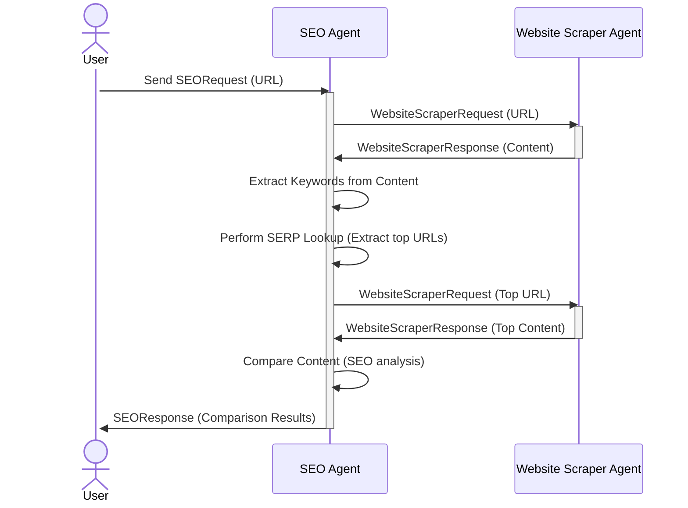

# SEO Analysis Agent

![tech:tech-name](https://img.shields.io/badge/tech%20tag-E85D2E?style=flat&logo=data%3Aimage%2Fsvg%2Bxml%3Bbase64%2CPHN2ZyB3aWR0aD0iMTAiIGhlaWdodD0iOCIgdmlld0JveD0iMCAwIDEwIDgiIGZpbGw9Im5vbmUiIHhtbG5zPSJodHRwOi8vd3d3LnczLm9yZy8yMDAwL3N2ZyI%2BCjxwYXRoIGQ9Ik00LjUgMUM0LjUgMS4yMTg3NSA0LjQyMTg4IDEuNDIxODggNC4zMTI1IDEuNTc4MTJMNC43NjU2MiAyLjU2MjVDNC45MjE4OCAyLjUzMTI1IDUuMDc4MTIgMi41IDUuMjUgMi41QzUuODEyNSAyLjUgNi4zMjgxMiAyLjcxODc1IDYuNzE4NzUgMy4wNjI1TDggMi4xMDkzOEM4IDIuMDc4MTIgOCAyLjA0Njg4IDggMkM4IDEuNDUzMTIgOC40Mzc1IDEgOSAxQzkuNTQ2ODggMSAxMCAxLjQ1MzEyIDEwIDJDMTAgMi41NjI1IDkuNTQ2ODggMyA5IDNDOC44NDM3NSAzIDguNzE4NzUgMi45ODQzOCA4LjU5Mzc1IDIuOTIxODhMNy4zMTI1IDMuODU5MzhDNy40MjE4OCA0LjE0MDYyIDcuNSA0LjQzNzUgNy41IDQuNzVDNy41IDUgNy40NTMxMiA1LjIzNDM4IDcuMzc1IDUuNDUzMTJMOC41IDYuMTI1QzguNjU2MjUgNi4wNDY4OCA4LjgxMjUgNiA5IDZDOS41NDY4OCA2IDEwIDYuNDUzMTIgMTAgN0MxMCA3LjU2MjUgOS41NDY4OCA4IDkgOEM4LjQzNzUgOCA4IDcuNTYyNSA4IDdWNi45ODQzOEw2Ljg1OTM4IDYuMzEyNUM2LjQ1MzEyIDYuNzM0MzggNS44NzUgNyA1LjI1IDdDNC4xNzE4OCA3IDMuMjgxMjUgNi4yNjU2MiAzLjA0Njg4IDUuMjVIMS44NTkzOEMxLjY4NzUgNS41NjI1IDEuMzU5MzggNS43NSAxIDUuNzVDMC40Mzc1IDUuNzUgMCA1LjMxMjUgMCA0Ljc1QzAgNC4yMDMxMiAwLjQzNzUgMy43NSAxIDMuNzVDMS4zNTkzOCAzLjc1IDEuNjg3NSAzLjk1MzEyIDEuODU5MzggNC4yNUgzLjA0Njg4QzMuMTcxODggMy43MzQzOCAzLjQ1MzEyIDMuMjk2ODggMy44NTkzOCAyLjk4NDM4TDMuNDA2MjUgMkMyLjg5MDYyIDEuOTUzMTIgMi41IDEuNTMxMjUgMi41IDFDMi41IDAuNDUzMTI1IDIuOTM3NSAwIDMuNSAwQzQuMDQ2ODggMCA0LjUgMC40NTMxMjUgNC41IDFaTTUuMjUgNS41QzUuNTE1NjIgNS41IDUuNzUgNS4zNTkzOCA1Ljg5MDYyIDUuMTI1QzYuMDMxMjUgNC45MDYyNSA2LjAzMTI1IDQuNjA5MzggNS44OTA2MiA0LjM3NUM1Ljc1IDQuMTU2MjUgNS41MTU2MiA0IDUuMjUgNEM0Ljk2ODc1IDQgNC43MzQzOCA0LjE1NjI1IDQuNTkzNzUgNC4zNzVDNC40NTMxMiA0LjYwOTM4IDQuNDUzMTIgNC45MDYyNSA0LjU5Mzc1IDUuMTI1QzQuNzM0MzggNS4zNTkzOCA0Ljk2ODc1IDUuNSA1LjI1IDUuNVoiIGZpbGw9IndoaXRlIi8%2BCjwvc3ZnPgo%3D)
[![link to source code](https://img.shields.io/badge/source%20code-E8ECF1?style=flat&logo=data%3Aimage%2Fsvg%2Bxml%3Bbase64%2CPHN2ZyB3aWR0aD0iOCIgaGVpZ2h0PSI4IiB2aWV3Qm94PSIwIDAgOCA4IiBmaWxsPSJub25lIiB4bWxucz0iaHR0cDovL3d3dy53My5vcmcvMjAwMC9zdmciPgo8cGF0aCBkPSJNNCAwLjA5ODk5OUMxLjc5IDAuMDk4OTk5IDAgMS44OSAwIDQuMDk5QzAgNS44NjY2NyAxLjE0NiA3LjM2NTY2IDIuNzM1IDcuODk0QzIuOTM1IDcuOTMxNjYgMy4wMDgzMyA3LjgwOCAzLjAwODMzIDcuNzAxNjZDMy4wMDgzMyA3LjYwNjY2IDMuMDA1IDcuMzU1IDMuMDAzMzMgNy4wMjE2N0MxLjg5MDY3IDcuMjYzIDEuNjU2IDYuNDg1IDEuNjU2IDYuNDg1QzEuNDc0IDYuMDIzMzMgMS4yMTEgNS45IDEuMjExIDUuOUMwLjg0ODY2NyA1LjY1MiAxLjIzOSA1LjY1NyAxLjIzOSA1LjY1N0MxLjY0MDY3IDUuNjg1IDEuODUxNjcgNi4wNjkgMS44NTE2NyA2LjA2OUMyLjIwODMzIDYuNjgwNjcgMi43ODggNi41MDQgMy4wMTY2NyA2LjQwMTY2QzMuMDUyNjcgNi4xNDMgMy4xNTU2NyA1Ljk2NjY3IDMuMjcgNS44NjY2N0MyLjM4MTY3IDUuNzY2NjcgMS40NDggNS40MjI2NyAxLjQ0OCAzLjg5QzEuNDQ4IDMuNDUzMzMgMS42MDMgMy4wOTY2NyAxLjg1OTY3IDIuODE2NjdDMS44MTQ2NyAyLjcxNTY3IDEuNjc5NjcgMi4zMDkgMS44OTQ2NyAxLjc1OEMxLjg5NDY3IDEuNzU4IDIuMjI5NjcgMS42NTA2NyAyLjk5NDY3IDIuMTY4QzMuMzE0NjcgMi4wNzkgMy42NTQ2NyAyLjAzNSAzLjk5NDY3IDIuMDMzQzQuMzM0NjcgMi4wMzUgNC42NzQ2NyAyLjA3OSA0Ljk5NDY3IDIuMTY4QzUuNzU0NjcgMS42NTA2NyA2LjA4OTY3IDEuNzU4IDYuMDg5NjcgMS43NThDNi4zMDQ2NyAyLjMwOSA2LjE2OTY3IDIuNzE1NjcgNi4xMjk2NyAyLjgxNjY3QzYuMzg0NjcgMy4wOTY2NyA2LjUzOTY3IDMuNDUzMzMgNi41Mzk2NyAzLjg5QzYuNTM5NjcgNS40MjY2NyA1LjYwNDY3IDUuNzY1IDQuNzE0NjcgNS44NjMzM0M0Ljg1NDY3IDUuOTgzMzMgNC45ODQ2NyA2LjIyODY2IDQuOTg0NjcgNi42MDMzM0M0Ljk4NDY3IDcuMTM4NjYgNC45Nzk2NyA3LjU2ODY3IDQuOTc5NjcgNy42OTg2N0M0Ljk3OTY3IDcuODAzNjcgNS4wNDk2NyA3LjkyODY3IDUuMjU0NjcgNy44ODg2N0M2Ljg1NSA3LjM2NCA4IDUuODY0IDggNC4wOTlDOCAxLjg5IDYuMjA5IDAuMDk4OTk5IDQgMC4wOTg5OTlaIiBmaWxsPSIjNTU2NTc4Ii8%2BCjwvc3ZnPgo%3D)](https://github.com/fetchai/uAgents-Examples/tree/main/agents)

This agent performs a SEO analysis by comparing the content of a given webpage with that of the top-ranking pages for similar keywords. It will retrieve the website content from a web scraper agent

## Diagram



## Example input

```python
SEORequest(
    url="https://www.meta.ai/"
)
```

## Example output

```python
SEOResponse(
    text="'The superior website 'SUPERIOR' ranks better for the keywords 'Natural language processing', 'machine learning', and 'deep learning' compared to the original website 'ORIGINAL' (https://www.meta.ai/). Concrete Examples: ...",
)
```

## Usage Example

Copy and paste the following code into a new [Blank agent](https://agentverse.ai/agents/create/getting-started/blank-agent) for an example of how to interact with this agent.

```python
from uagents import Agent, Context, Model

class SEORequest(Model):
    url: str

class SEOResponse(Model):
    text: str


agent = Agent()

SEO_AGENT_ADDRESS = "<deployed_agent_address>"

prompt = SEORequest(url="https://www.meta.ai/")

@agent.on_event("startup")
async def handle_startup(ctx: Context):
    """Send the prompt to the AI agent on startup."""
    await ctx.send(SEO_AGENT_ADDRESS, prompt)
    ctx.logger.info(f"Sent prompt to AI agent: {prompt}")


@agent.on_message(SEOResponse)
async def handle_response(ctx: Context, sender: str, msg: SEOResponse):
    """Do something with the response."""
    ctx.logger.info(f"Received response from: {sender}:\n\n{msg.text}\n")


if __name__ == "__main__":
    agent.run()
```

### Local Agent

1. Install the necessary packages:

   ```bash
   pip install uagents
   ```

2. To interact with this agent from a local agent instead, replace `agent = Agent()` in the above with:

   ```python
   agent = Agent(
       name="user",
       endpoint="http://localhost:8000/submit",
   )
   ```

3. Run the agent:
   ```bash
   python agent.py
   ```
